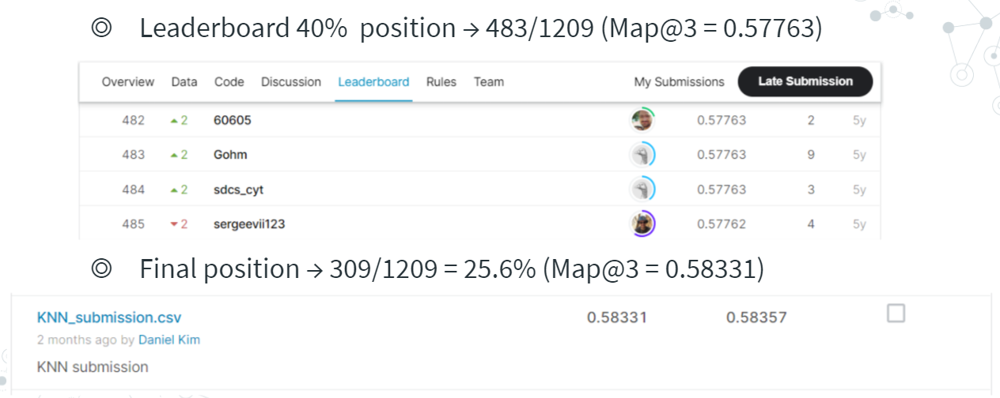

# Facebook V: Predicting Check Ins
## 결과
### 용약정보
- 도전기관: 한양대학교
- 도전자: 김진훈
- 최종스코어: 0.58331
- 제출일자: 2021-07-08
- 총 참여 팀수: 1209
- 순위 및 비울: 25.6%
### 결과화면

## 사용한 방법 & 알고리즘
KNeighborsClassifier
- Feature engineering
  - Divide the artificial world into a grid of arbitrary number of cells
- LightGBM Model Optimization using validation set
  - n_neighbors and leaf_size parameters dependent on the number of observations
## 코드
[`./facebook-v-predicting-check-ins.ipynb`](./facebook-v-predicting-check-ins.ipynb)
## 참고 자료
- [KNN accelerated V3](https://www.kaggle.com/zeroblue/knn-accelerated-v3)