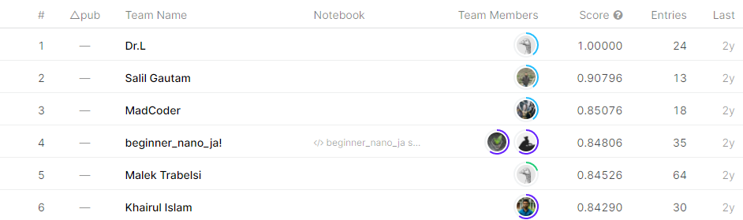

# forest-cover-type-kernels-only

## 결과

### 요약정보

- 도전기관 : 한양대학교
- 도전자 : 안준항
- 최종스코어 :0.84836
- 제출일자 : 2021-01-05
- 총 참여 팀 수 : 358
- 순위 및 비율 : 4(1.12%)

### 결과화면

## 사용한 방법 & 알고리즘

In this question I refer to the nadare’s kernel,Ykskks’s kernel and also stacking their models.

In Nadare's Kernel, he has created 4 models.
used Model:
K-nearest Neighbors Classifier
Random Forest Classifier
Logistic Regression
LightGBM 
Using these learning machines, data for stacking was created using 10-fold cross validation without KNN&DT feature

In Ykskks's Kernel,he used feature engineering ideas based on Lathwal's amazing kernel.
usde model:
-Random Forest Classifier
-LightGBM
-LinearRegression
-SVM

Stacking with LightGBM

## 코드

[`./forestcovertype.ipynb`](./forestcovertype.ipynb)

## 참고 자료
