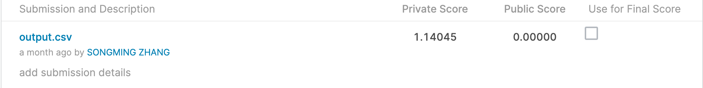
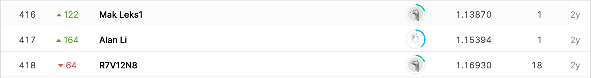

# Google Analytics Customer Revenue Prediction

## 결과

### 요약정보

- 도전기관 : 한양대학교
- 도전자 : 장송밍
- 최종스코어 :1.14045
- 제출일자 : 2021-04-01
- 총 참여 팀 수 : 3611
- 순위 및 비율 : 417(11.54%)

### 결과화면

## 사용한 방법 & 알고리즘

LightGBM

## 코드

[`./ga-customer-revenue-prediction.ipynb`](./ga-customer-revenue-prediction.ipynb)

## 참고 자료
