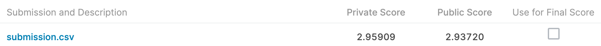
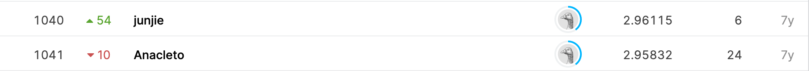

# Higgs Boson Machine Learning Challenge

## 결과

### 요약정보

- 도전기관 : 한양대학교
- 도전자 : 장송밍
- 최종스코어 :2.95909
- 제출일자 : 2021-06-10
- 총 참여 팀 수 : 1784
- 순위 및 비율 : 1041(58.35%)

### 결과화면

## 사용한 방법 & 알고리즘

RNN

## 코드

[`./higgs-boson.ipynb`](./higgs-boson.ipynb)

## 참고 자료
