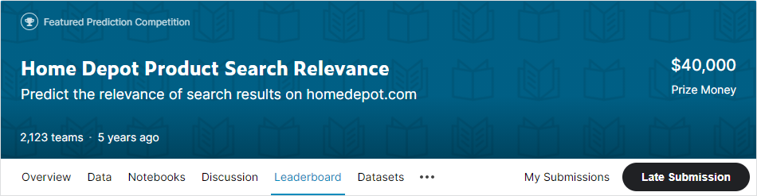
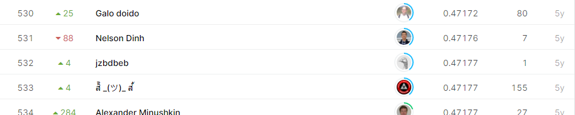

# Home Depot Product Search Relevance

## 결과

### 요약정보

- 도전기관 : 한양대학교
- 도전자 : 마지흔
- 최종스코어 : 0.47177
- 제출일자 : 2021-01-25
- 총 참여 팀 수 : 2123
- 순위 및 비율 : 532(25.05%)

### 결과화면

## 사용한 방법 & 알고리즘

regular expression

feature engineering

Random Forest

TF-IDF

loss function: MAE

## 코드

[`./home-depot-challenge.ipynb`](./home-depot-challenge.ipynb)

## 참고 자료