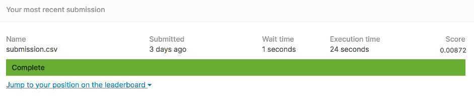
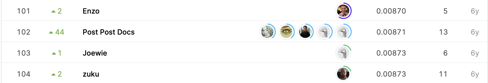

# How Much Did It Rain?

## 결과

### 요약정보

- 도전기관 : 한양대학교
- 도전자 : 등우진
- 최종스코어 : 0.00872
- 제출일자 : 2021-04-08
- 총 참여 팀 수 : 319
- 순위 및 비율 : 103(32.28%)

### 결과화면

## 사용한 방법 & 알고리즘

1.data cleaning
2.dealing with missing data
3.dadar quality index as a feature
4.hybird scan
5.traing matrics
6.XGB

## 코드

[`./binned_features.py`](./binned_features.py)
[`./functions.py`](./functions.py)
[`./main.sh`](./main.sh)
[`./make_binned_features_test.sh`](./make_binned_features_test.sh)[`./make_binned_features_train.sh`](./make_binned_features_train.sh)[`./make_predictions.py`](./make_predictions.py)[`./standard_features.py`](./standard_features.py)
[`./train_subset1.py`](./train_subset1.py)
[`./train_subset2.py`](./train_subset2.py)
[`./train_subset3.py`](./train_subset3.py)
[`./train_subset4.py`](./train_subset4.py)
[`./train_subset5.py`](./train_subset5.py)

## 참고 자료
