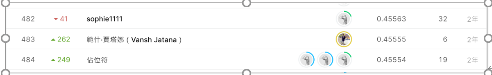

# Human Protein Atlas Image Classification

### ### 요약정보

- 도전기관 : 한양대학교
- 도전자 : 상천가
- 최종스코어 : 0.45557
- 제출일자 : 2020-12-29
- 총 참여 팀 수 : 2119
- 순위 및 비율 : 483(23%)

### ### 결과화면



## 사용한 방법 & 알고리즘

 I  using a light ResNet34 model and low-resolution images to have a baseline that can be used later to select higher end models and explore the effect of image resolution on the prediction accuracy. The validation F1 score of the model is ~0.5-0.6

- - ```
    
    ```

## ## 코드

[ ./human-protein-atlas-image-classification.py](./human-protein-atlas-image-classification.py)

## ### 참고 자료

