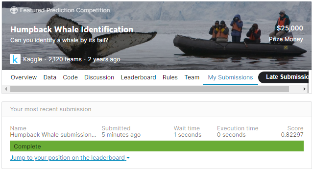
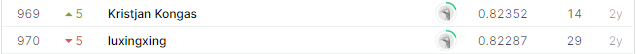

# Humpback Whale identification - Machine Learning from Disaster

## 결과

### 요약정보

- 도전기관 : 한양대학교
- 도전자 : 장호
- 최종스코어 : 0.82297
- 제출일자 : 2021-04-14
- 총 참여 팀 수 : 2120
- 순위 및 비율 : 970(48.02%)

### 결과화면

## 코드

[`./Humpback.ipynb`](./Humpback.ipynb)

## 참고 자료

- [Basic Feature Engineering with the Humpback Whale Identification Data](https://www.kaggle.com/c/humpback-whale-identification/data)
