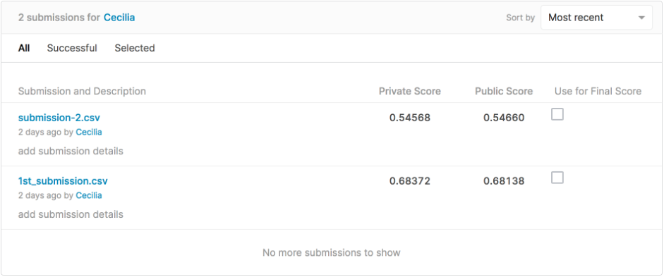
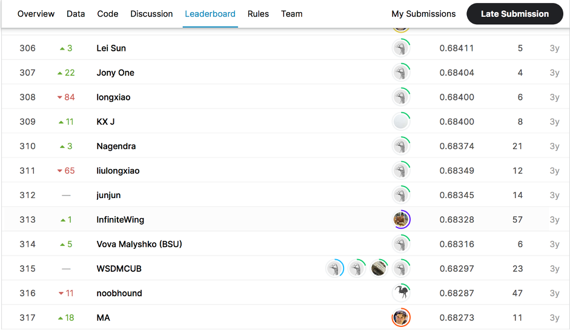

# WSDM - KKBox's Music Recommendation Challenge

## 결과

### 요약정보

- 도전기관 : 한양대학교
- 도전자 : 등우진
- 최종스코어 : 0.68372
- 제출일자 : 2021-04-08
- 총 참여 팀 수 :1081
- 순위 및 비율 : 311(28.77%)

### 결과화면

## 사용한 방법 & 알고리즘

basic of LGBM

## 코드

[`./main.py`](./main.py)

## 참고 자료
