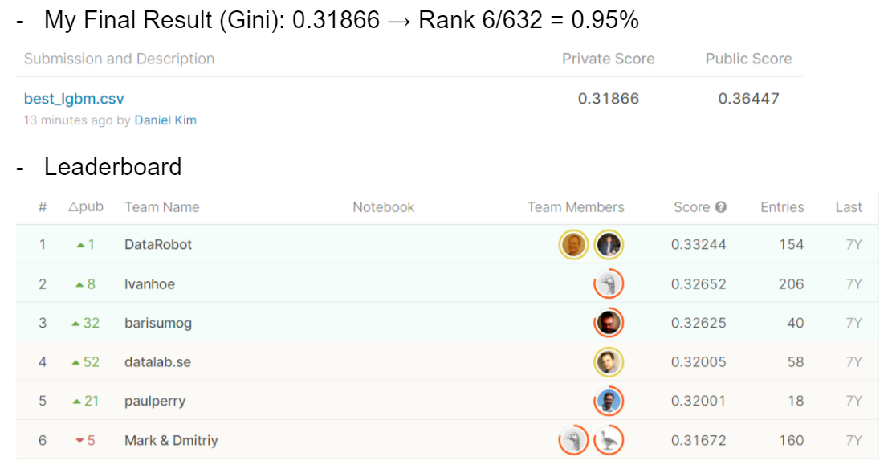

# Liberty Mutual Group - Fire Peril Loss Cost
## 결과
### 요약정보
- 도전기관: 한양대학교
- 도전자: 김진훈
- 최종스코어: 0.31866
- 제출일자: 2021-11-29
- 총 참여 팀수: 632
- 순위 및 비울: 6/632 (0.95%)
### 결과화면

## 사용한 방법 & 알고리즘
- Preprocessing: Used the correlation matrix given by user Μαριος Μιχαηλιδης KazAnova to remove many useless features
- Hyperparameter Tuning: skopt and mlflow libraries
- Final model: optimized LGBM
## 코드
[`./liberty-mutual-fire-peril.ipynb`](./liberty-mutual-fire-peril.ipynb)
## 참고 자료
- EDA: https://www.kaggle.com/c/liberty-mutual-fire-peril/discussion/10194
