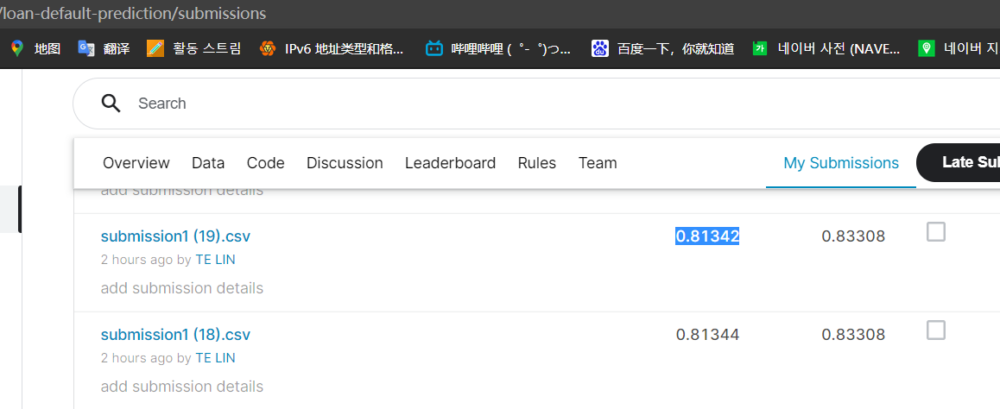
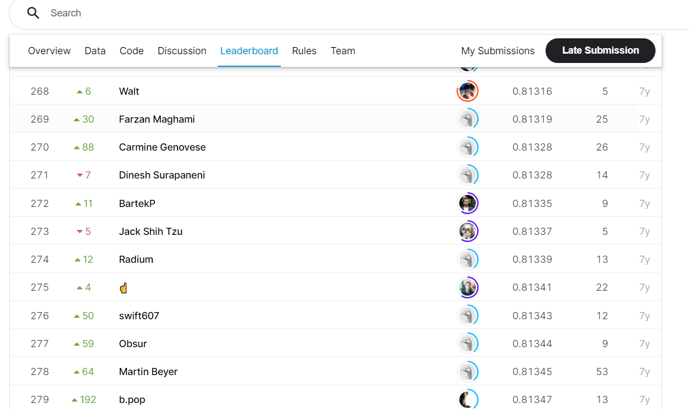

# Loan Default Prediction - Imperial College London

## 결과

### 요약정보

- 도전기관 : 한양대학교
- 도전자 : 임특
- 최종스코어 : 0.81342
- 제출일자 : 2021-04-20
- 총 참여 팀 수 : 672
- 순위 및 비율 : 276/41%

### 결과화면

```


```

## 사용한 방법 & 알고리즘

- Feature engineering
  - Use the VIF method for feature selection and dimensionality reduction
  - PCA(X)
- model building 
  - Xgboost is used 

## 코드

```
[./loan-default-prediction.py](./loan-default-prediction.py)
```

## 참고 자료

- ```
  [VIF](https://zhuanlan.zhihu.com/p/96193669)
  [VIF](https://www.kaggle.com/abeersaxena/submission-31-08-2020)
  ```

