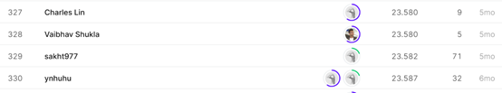

# # Lyft Motion Prediction for Autonomous Vehicles

## ## 결과

### ### 요약정보

- 도전기관 : 한양대학교
- 도전자 : 상천가
- 최종스코어 : 23.580
- 제출일자 : 2020-4-15
- 총 참여 팀 수 : 935
- 순위 및 비율 : 328（35%)

### ### 결과화면



## ## 사용한 방법 & 알고리즘

 I present an end-to-end train and prediction pipeline to predict vehicle motions with a pre-trained model included.

Environment setup
Please add pestipeti/lyft-l5kit-unofficial-fix as utility script.
Official utility script "Phil Culliton/Kaggle-l5kit" does not work with PyTorch GPU.

Also please add trained baseline model
Click on the button "Add data" in the "Data" section and search for Lyft-pre-trained-model-hv. If you find the model useful, please upvote it as well.

- - ```
    
    ```

## ## 코드

[  ./lyft-motion-prediction-autonomous-vehicles.py](./lyft-motion-prediction-autonomous-vehicles.py)

## ## 참고 자료

