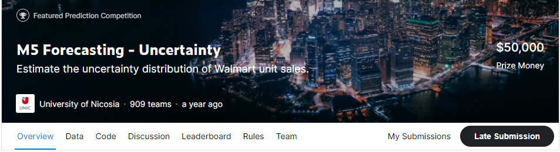
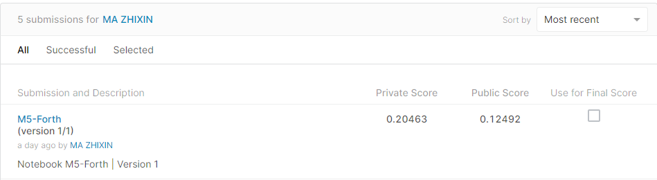
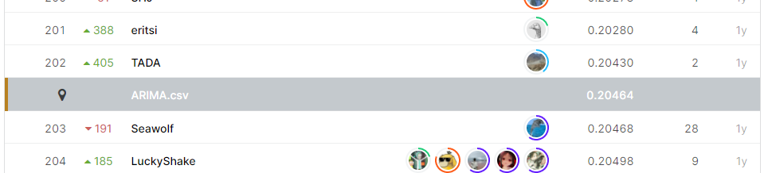

# M5 Forecasting - Uncertainty

## 결과

### 요약정보

- 도전기관 : 한양대학교
- 도전자 : 마지흔
- 최종스코어 : 0.20463
- 제출일자 : 2021-05-27
- 총 참여 팀 수 : 909
- 순위 및 비율 : 203(22.33%)

### 결과화면

## 사용한 방법 & 알고리즘

loss function: Pinball loss

neural network

## 코드

[`./m5.ipynb`](./m5.ipynb)

## 참고 자료

