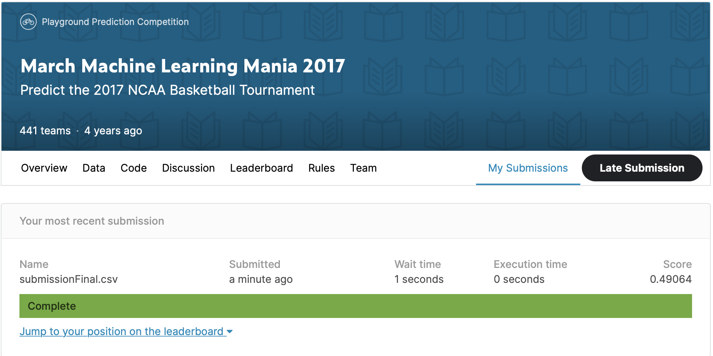
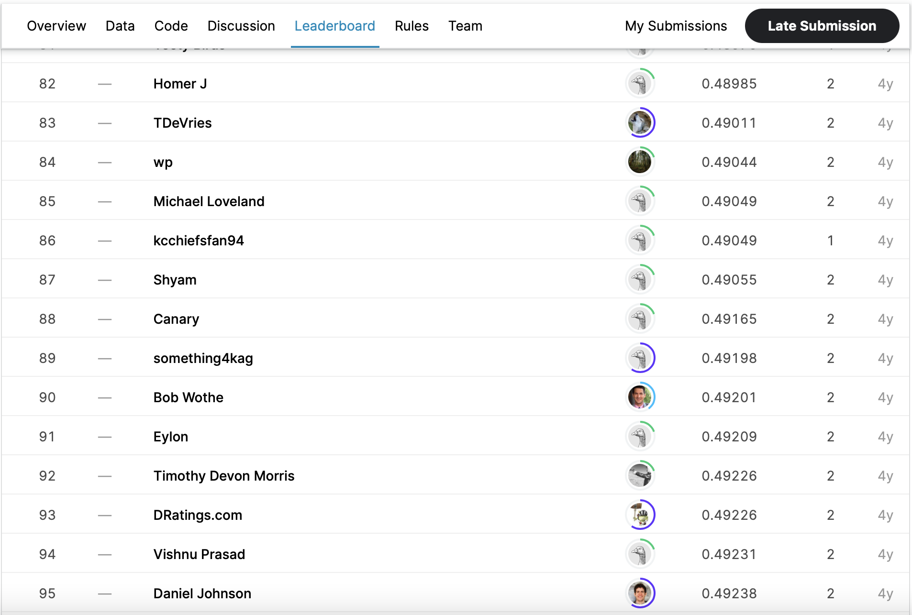

# March Machine Learning Mania 2017

## 결과

### 요약정보

- 도전기관 : 한양대학교
- 도전자 : CAO GANG
- 최종스코어 : 0.49064
- 제출일자 : 2021-05-14
- 총 참여 팀 수 : 441
- 순위 및 비율 : 88(19.95%)

### 결과화면

## 사용한 방법 & 알고리즘

간단한 로지스틱 회귀 모델을 사용했습니다.

- Feature engineering
  - Feature selection
- Use Logistic Regression To Predict Game Outcomes
  - max_iter=5000
  - cv=10
  

## 코드

[`./NCAAPrediction.py`](./NCAAPrediction.py)

## 참고 자료

- [Logistic Regression](https://scikit-learn.org/stable/modules/generated/sklearn.linear_model.LogisticRegression.html)
- [cross-validation](https://scikit-learn.org/stable/modules/generated/sklearn.model_selection.cross_val_score.html)