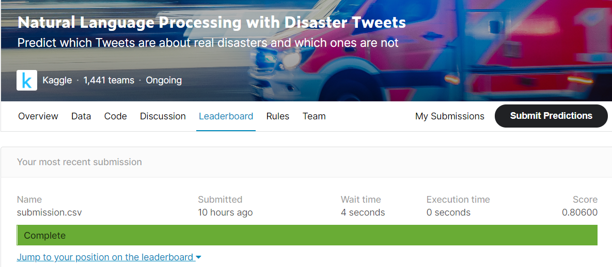
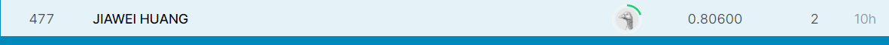

# Natural Language Processing with Disaster Tweets

## 결과

### 요약정보

- 도전기관 : 한양대학교
- 도전자 : 황가위
- 최종스코어 : 0.80600
- 제출일자 : 2021-03-11
- 총 참여 팀 수 : 1441
- 순위 및 비율 : 477(33%)

### 결과화면

## 사용한 방법 & 알고리즘

2. 데이터 설명
train.csv

​       test.csv  

3. 알고리즘 설명
  Feature engineering and LogisticRegression

  

## 코드

['./Natural Language Processing with Disaster Tweets.py'](./Natural Language Processing with Disaster Tweets.py)

## 참고 자료

- 