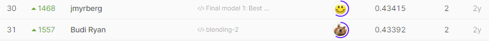

# PetFinder.my Adoption Prediction

## 결과

### 요약정보

- 도전기관 : 한양대학교
- 도전자 : 안준항
- 최종스코어 : 0.43414
- 제출일자 : 2021-03-22
- 총 참여 팀 수 : 1788
- 순위 및 비율 : 31(1.73%)

### 결과화면

## 사용한 방법 & 알고리즘
In this competition, the data set contains tabular data,text data and image data.
And for Image data, I also referenced the 'Extract Image features from pretrained NN' and 'Extract Image Features'
I put both of them in the Petfinder.ipynb code.
In the notebook also has a baseline Modeling made by 'BaselineModeling' as a reference.
At last stacking the results.

## 코드

[`./Petfinder.ipynb`](./Petfinder.ipynb)

## 참고 자료

- [BaseLine Modeling] https://www.kaggle.com/wrosinski/baselinemodeling
- [Extract Image feature frome pretrained NN] https://www.kaggle.com/christofhenkel/extract-image-features-from-pretrained-nn
- [Add Extract Image feature] https://www.kaggle.com/kaerunantoka/extract-image-features