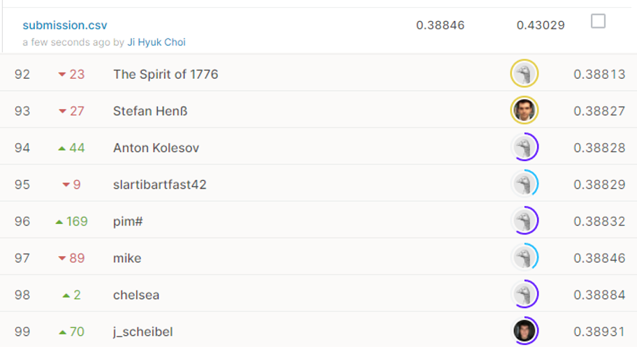

# Predicting a Biological Response

## 결과

### 요약정보

- 도전기관 : 시큐레이어
- 도전자 : 최지혁
- 최종스코어 : 0.38846
- 제출일자 : 2021-02-26
- 총 참여 팀 수 : 698
- 순위 및 비율 : 98(14.04%)

### 결과화면

## 사용한 방법 & 알고리즘
1. 대회설명
 연구소에서 진행하는 대회이다. 현재 연구중인 분자가 특정 생물에게 생물학적 반응을 유도하는지 모든 정보가 마스킹된 채이다. 주어진 피쳐들로 훈련하여 각 ID당 반응할 확률을 구해야 한다.

2. 데이터 설명
train.csv: 반응결과(Activity), 생물학적 반응 (D1~D1776)  (id는 1부터 row 개수만큼)
int형:   825 columns
float형: 951 columns
훈련용 Y값: boolean   (target)
테스트용 예측값: float (0~1 -> 확률)
 
test.csv: target제외, train.csv와 나머지 동일

3. 알고리즘 설명
MinMaxScaler를 통해 피쳐들의 값을 스케일링한 후 kfold+gridsearch를 이용하여 파라미터 튜닝. 모델은 LightGBM이다. 

## 코드

['./main_predicting_a_biological_response.py'](./main_predicting_a_biological_response.py)

## 참고 자료

- 
