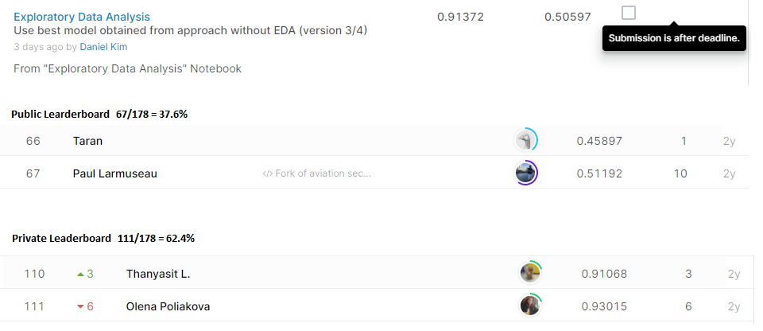

# Reducing Commercial Aviation Fatalities
## 결과
### 용약정보
- 도전기관: 한양대학교
- 도전자: 김진훈
- 최종스코어: 0.91372
- 제출일자: 2021-05-07
- 총 참여 팀수: 178
- 순위 및 비울: 62.4%
### 결과화면

## 사용한 방법 & 알고리즘
LightGBM
- Feature engineering
- LightGBM Model Optimization using validation set
  - learning_rate: 0.04
  - max_depth: 10
  - num_leaves: 27
  - min_data_in_leaf: 156
  - feature_fraction: 0.515
  - subsample: 0.235
  - objective: 'multiclass'
  - early_stopping_rounds: 50
## 코드
[`./reducing-commercial-aviation-fatalities.ipynb`](./reducing-commercial-aviation-fatalities.ipynb)
## 참고 자료
- [SimonStrong Team Modeling](https://www.kaggle.com/shmilyms/simonstrong-analysis-summary-12th)
