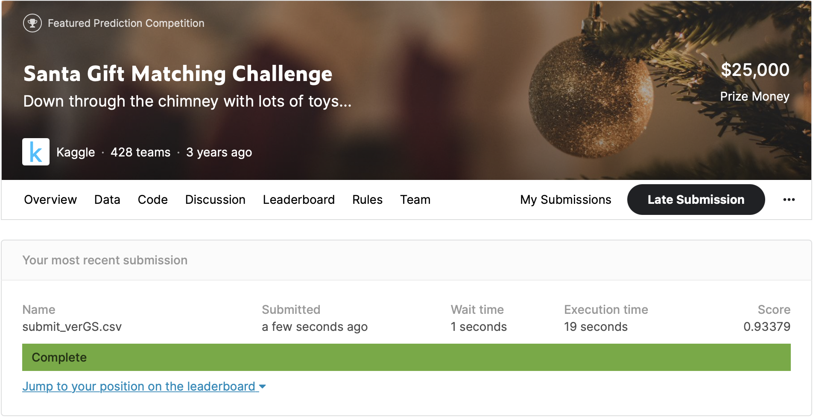
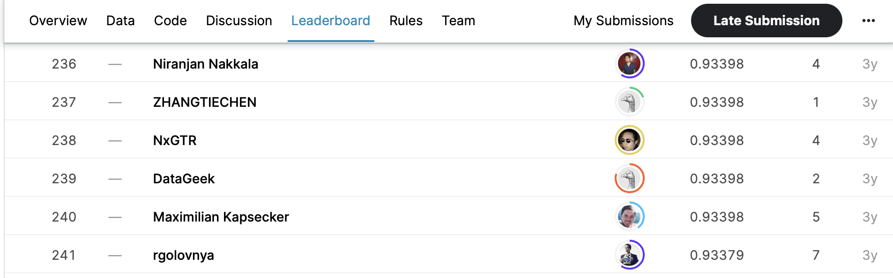

# March Machine Learning Mania 2017

## 결과

### 요약정보

- 도전기관 : 한양대학교
- 도전자 : CAO GANG
- 최종스코어 : 0.93379
- 제출일자 : 2021-06-18
- 총 참여 팀 수 : 428
- 순위 및 비율 : 241(56.31%)

### 결과화면

## 사용한 방법 & 알고리즘

- The min cost flow problem
  - The problem is to find a flow with the least total cost.
  - Find the minimum cost flow with google ortools.

## 코드

[`./SantaGiftMatching.py`](./SantaGiftMatching.py)

## 참고 자료

- [Minimum Cost Flows](https://developers.google.com/optimization/flow/mincostflow)
