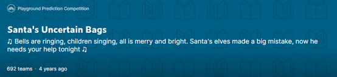
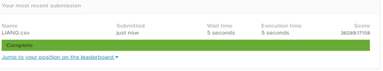
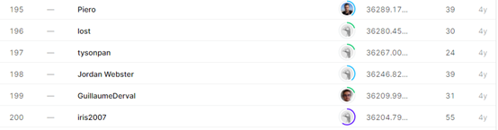

# **Santa’s Uncertain Bags**

## 결과

### 요약정보

- 도전기관 : 한양대학교
- 도전자 : 이앙
- 최종스코어 : 36289.171
- 제출일자 : 2021-03-18
- 총 참여 팀 수 : 692
- 순위 및 비율 : 195(28.17%)

### 결과화면

## 사용한 방법 & 알고리즘

- - 

## 코드

[`code`](./Santa.py)

## 참고 자료

- 

