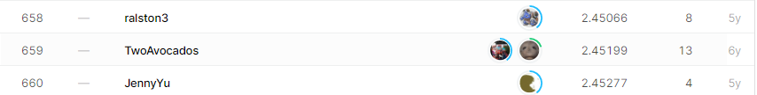

# sf-crime

## 결과

### 요약정보

- 도전기관 : 한양대학교
- 도전자 : 안준항
- 최종스코어 :2.45162
- 제출일자 : 2021-04-14
- 총 참여 팀 수 : 2331
- 순위 및 비율 : 659(28.27%)

### 결과화면

## 사용한 방법 & 알고리즘

In this question I  used CNN and KNN

For KNN, it just cause about the 73%
For CNN, it just cause the 28.27%, also made a different feature engineering between KNN

## 코드

[`./sanfran-2-4.ipynb`](./sanfran-2-4.ipynb)

## 참고 자료
