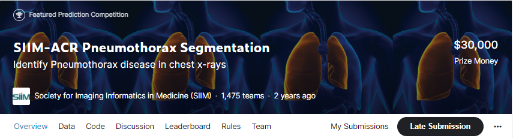
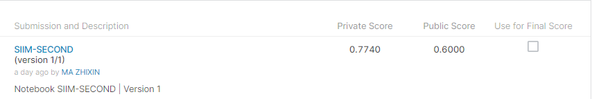
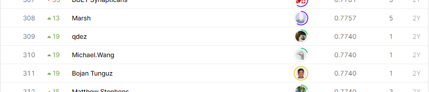

# SIIM-ACR Pneumothorax Segmentation

## 결과

### 요약정보

- 도전기관 : 한양대학교
- 도전자 : 마지흔
- 최종스코어 : 0.7740
- 제출일자 : 2021-11-24
- 총 참여 팀 수 : 1475
- 순위 및 비율 : 309(20.95%)

### 결과화면

## 사용한 방법 & 알고리즘

Unet 네트워크 모델을 사용했습니다.

## 코드

[`./siim.ipynb`](./siim.ipynb)

## 참고 자료
