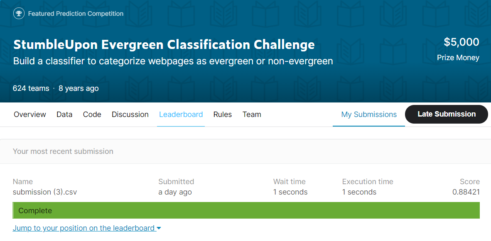
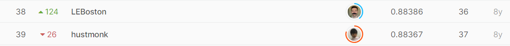

# StumbleUpon Evergreen Classification Challenge

## 결과

### 요약정보

- 도전기관 : 한양대학교
- 도전자 : 황가위
- 최종스코어 : 0.88421
- 제출일자 : 2021-06-10
- 총 참여 팀 수 : 624
- 순위 및 비율 : 38(6%)

### 결과화면

## 사용한 방법 & 알고리즘

1. 데이터 설명
   train.csv

​       test.csv  

2. 알고리즘 설명
   Feature engineering and Bert + Bi-LSTM + Dropout

## 코드

## 참고 자료

- 