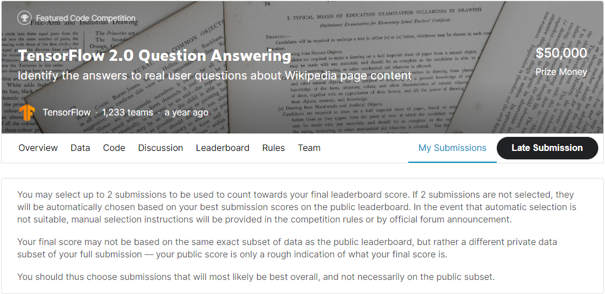
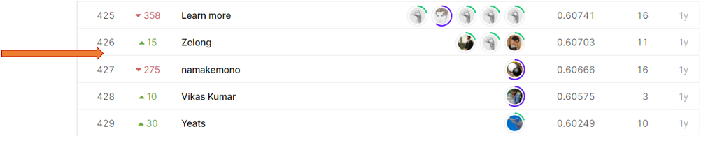
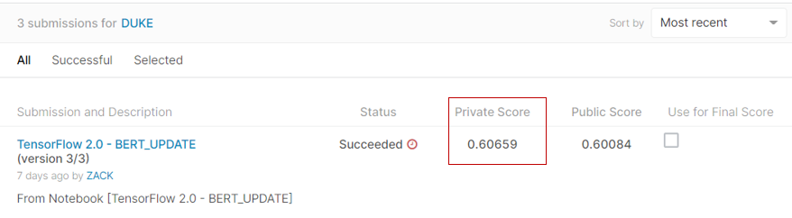

# tensorflow2-question-answering

## 결과

### 요약정보

- 도전기관 : Hanyang University
- 도전자 : 듀크
- 최종스코어 : 0.60659
- 제출일자 : 2021-05-21
- 총 참여 팀 수 : 1,233
- 순위 및 비율 : 427(34.63%)

### 결과화면

## 사용한 방법 & 알고리즘

간단한 뉴럴 네트워크 모델을 사용했습니다.

## 코드

['tensorflow-2-0-bert-update.ipynb'](./tensorflow-2-0-bert-update.ipynb)

## 참고 자료

- [Basic Feature Engineering with the tensorflow2-question-answering Data](https://www.kaggle.com/c/tensorflow2-question-answering/submissions)
