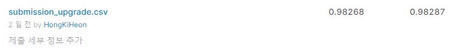
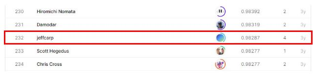

# text-normalization-challenge-english-language

## 결과

### 요약정보

- 도전기관 : 시큐레이어
- 도전자 : 홍기헌
- 최종스코어 : 0.98287
- 제출일자 : 2021-04-12
- 총 참여 팀 수 : 261
- 순위 및 비율 : 232(88.89%)

### 결과화면

## 사용한 방법 & 알고리즘
방법1. 
- 단어 인코딩(ASCII Code)
- Padding 배열 저장
- Training Target(class column) Label Encoding
- Feature 차원 변환(for CNN)
- 1차원 CNN 모델 사용 

방법2. 
- 단어 인코딩(ASCII Code)
- Padding 배열 저장
- Training Target(class column) Label Encoding
- Feature 차원 변환(for CNN)
- 1차원 CNN 모델 사용
- Stratified KFold 교차검증 방식 사용

방법3. 
- 단어 인코딩(ASCII Code)
- Padding 배열 저장
- Training Target(class column) Label Encoding
- RandomForest Classifier 모델 사용 

## 코드

['./Text_Normalization_cnn_training.py'](./Text_Normalization_cnn_training.py)
['./Text_Normalization_cnn_kfold_training.py'](./Text_Normalization_cnn_kfold_training.py)
['./Text_Normalization_rf_training.py'](./Text_Normalization_rf_training.py)
['./Text_Normalization_postprocessing.py'](./Text_Normalization_postprocessing.py)

