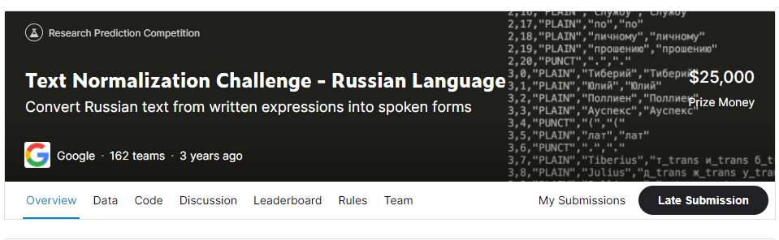
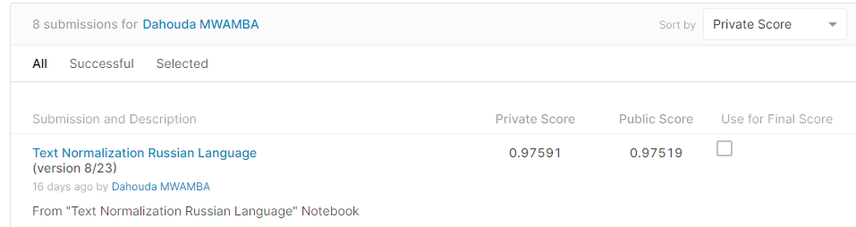

# Text-Normalization Challenge Russian Language

## 결과

### 요약정보

- 도전기관 : 한양대학교
- 도전자 : MWAMBA KASONGO Dahouda
- 최종스코어 : 0.97591
- 제출일자 : 2021-05-12
- 총 참여 팀 수 : 162
- 순위 및 비율 : 67(41.36%)

### 결과화면

## 사용한 방법 & 알고리즘

간단한 뉴럴 네트워크 모델을 사용했습니다.

Importants Libraries

- num2words is a library that converts numbers like 42 to words like forty-two.
- Roman : integer to roman numerals converter
- inflect python library : Correctly generate plurals, singular nouns, ordinals, indefinite articles; convert numbers to words. 
This is a process known as text normalization, and helps convert :

12:47 to "twelve forty-seven" 
$3.16 into "three dollars, sixteen cents." 

Evaluation : Submissions are evaluated on prediction accuracy : sequence accuracy.
For example, if the input is "145" and the predicted output is "one forty five" 
            but if the output is "one hundred forty five", this is counted as a single error.

## 코드

[`./text-normalization-russian-language.ipynb`](./text-normalization-russian-language.ipynb)

## 참고 자료

- [Image data augmentation layers with Keras](https://www.tensorflow.org/guide/keras/preprocessing_layers)
