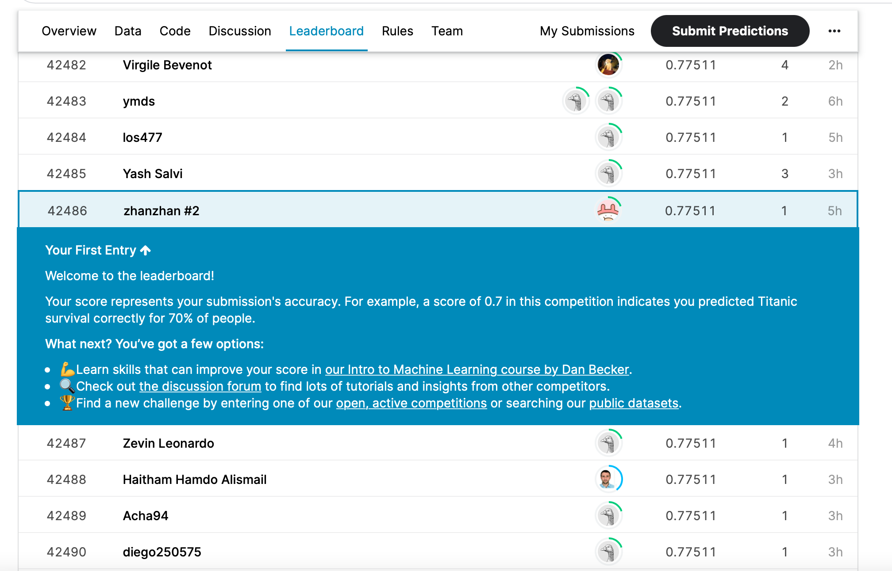

# Titanic - Machine Learning from Disaster

## 결과

### 요약정보

- 도전기관 : 한얀대학교
- 도전자 : 왕전
- 최종스코어 : 0.77511
- 제출일자 : 2021-09-26
- 총 참여 팀 수 : 50265
- 순위 및 비율 : 42486(84.52%)

### 결과화면

## 사용한 방법 & 알고리즘

간단한 뉴럴 네트워크 모델을 사용했습니다.

- 결측값 채우기
- Feature engineering
  - Feature selection
- Full connected neural network
  - 16 nodes
  - 8 nodes
  - 1 output

## 코드

## 참고 자료

- [Basic Feature Engineering with the Titanic Data](https://triangleinequality.wordpress.com/2013/09/08/basic-feature-engineering-with-the-titanic-data/)
