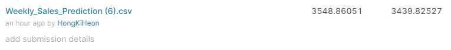
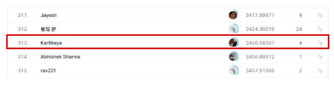

# walmart-recruiting-store-sales-forecasting

## 결과

### 요약정보

- 도전기관 : 시큐레이어
- 도전자 : 홍기헌
- 최종스코어 : 3439.82527
- 제출일자 : 2021-04-02
- 총 참여 팀 수 : 689
- 순위 및 비율 : 313(45.43%)

### 결과화면

## 사용한 방법 & 알고리즘
방법1. 
- Training Data(Train, Stores, Features) merge 
- 파생 feature(Year, Month, Day, Week) 생성
- 결측치 제거
- Feautre 정렬 / 추출
- Feature Scaling(MinMax Scaler)
- RNN 중 GRU 모델 사용

방법2. 
- Training Data(Train, Stores, Features) merge 
- 파생 feature(Year, Month, Day, Week) 생성
- 결측치 제거
- Feautre 정렬 / 추출
- Feature Scaling(MinMax Scaler)
- DNN 모델 사용

방법3. 
- Training Data(Train, Stores, Features) merge 
- 파생 feature(Year, Month, Day, Week) 생성
- 결측치 제거
- Feautre 정렬 / 추출
- Feature Scaling(MinMax Scaler)
- RandomForest Regressor 모델 사용

## 코드

['./walmart_gru.py'](./walmart_gru.py)
['./walmart_dnn.py'](./walmart_dnn.py)
['./walmart_rf.py'](./walmart_rf.py)

