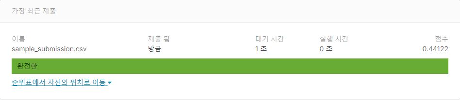

# Humpback Whale Identification Challenge
## 결과

### 요약정보

- 도전기관 : 시큐레이어
- 도전자 : 홍기헌
- 최종스코어 : 0.44122
- 제출일자 : 2021-03-09
- 총 참여 팀 수 : 528
- 순위 및 비율 : 55(10.41%)

### 결과화면

## 사용한 방법 & 알고리즘

- Image directory / Training table Image column 매핑
- Image Scaling
- Image 형변환
- Training Target Label(Id column) Label Encoding
- Training Target Label(Id column) OneHot Encoding
- CNN 알고리즘을 통한 학습

## 코드

['./humpbackWhale.py'](./humpbackWhale.py)

## 참고 자료
