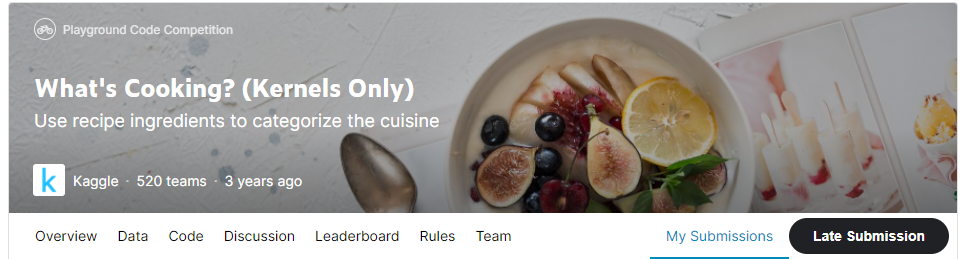
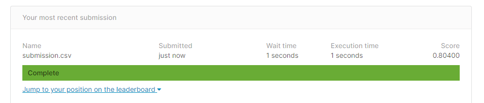
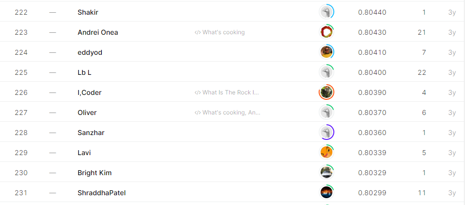

# **What's Cooking? (Kernels Only)**

## 결과

### 요약정보

- 도전기관 : 한양대학교
- 도전자 : 이앙
- 최종스코어 :  0.804
- 제출일자 : 2021-02-21
- 총 참여 팀 수 : 520
- 순위 및 비율 : 225(39.77%)

### 결과화면

## 사용한 방법 & 알고리즘

- - 

## 코드

[`code`](./What.py)

## 참고 자료

- 

