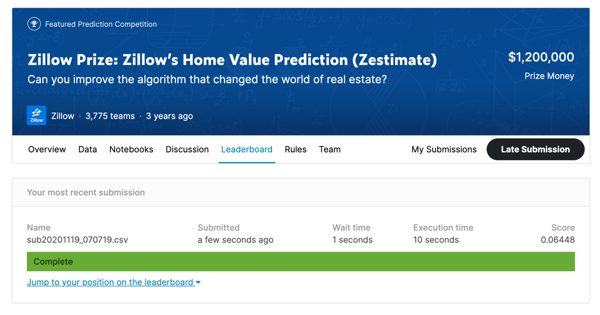
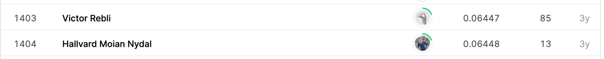

## Zillow Prize: Zillow's Home Value Prediction (Zestimate)

## 결과

### 요약정보

- 도전기관 : 한양대학교
- 도전자 : 왕흠원
- 최종스코어 : 0.06448
- 제출일자 : 2021-02-18
- 총 참여 팀 수 : 3775
- 순위 및 비율 : 1404 (37.19%)

### 결과화면

## 사용한 방법 & 알고리즘

## 코드

[`./zillow.py`](./zillow.py)

## 참고 자료
